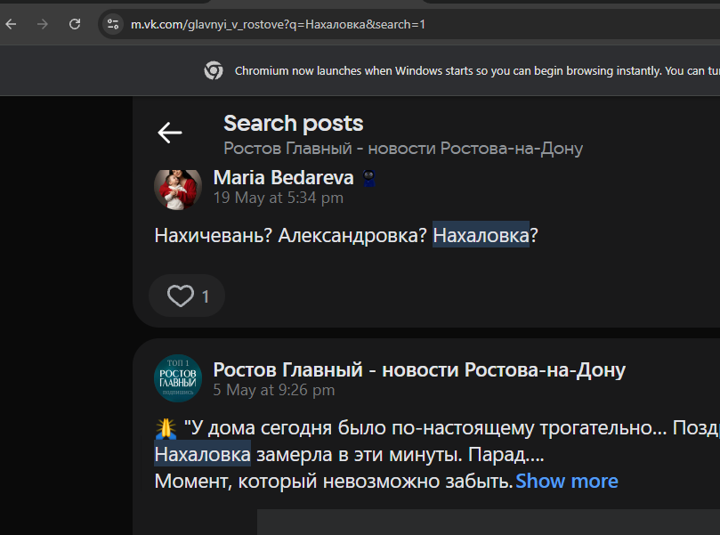
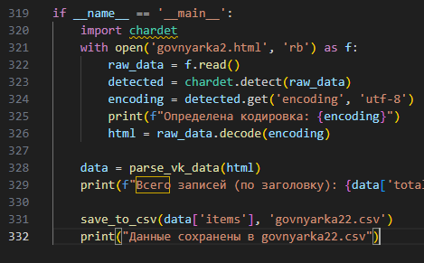

Открывайте расширенный поисковик в вк (пример)

Скачивайте страницу (save as) или как complete, если комментариев и постов выше 50, или как обычный single/html only если меньше

После чего пропишите название файла для парса и название вывода

(Иногда случается баг с кодировкой, но здесь вы справитесь я щииииитаю :shipit:)
